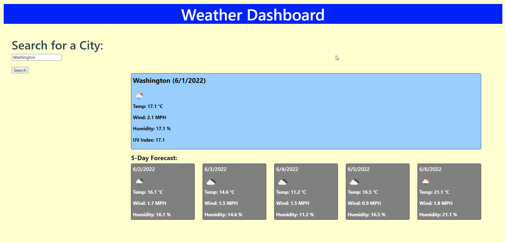

# **Weather Dashboard**
## Webpage for the weather dashboard

### **Project Description:**
This website provides weather forecasts for cities around the world by getting weather data using the OpenWeather API.

### **Technologies Used & Acceptance Criteria:**
This website uses these technologies to work properly:
- [HTML] - HyperText Markup Language.
- [CSS] - Cascading Style Sheets used for the website styles.
- [JS] - Advanced JavaScript Language.
- [Bootstrap]
- [Moment.js]
- [OpenWeather API]

This website was coded using the Acceptance Criteria mentioned below:
- WHEN I search for a city, THEN I am presented with current and future conditions for that city and that city is added to the search history.
- WHEN I view current weather conditions for that city, THEN I am presented with the city name, the date, an icon representation of weather conditions, the temperature, the humidity, and the wind speed.
- WHEN I view future weather conditions for that city, THEN I am presented with a 5-day forecast that displays the date, an icon representation of weather conditions, the temperature, the wind speed, and the humidity.

### **Deployed website link:**
https://rakibca.github.io/weather-dashboard/

### **Credits:**
- [W3Schools](https://www.w3schools.com "W3Schools")
- [MDN Web Docs](https://developer.mozilla.org "MDN Web Docs")
- [Google](https://www.google.com "Google's Homepage")
- [Stack Overflow](https://stackoverflow.com "Stack Overflow website")
